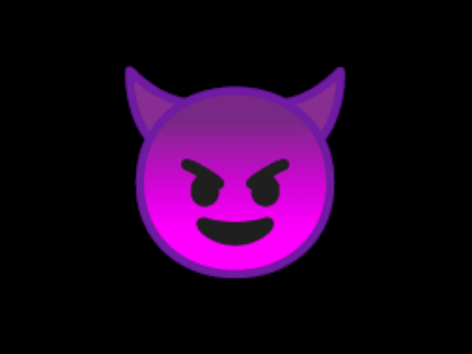

# emojis_lite



## Overview
Emojis_lite adds an inventory menu, from which a player can display various emojis. The mod also provides an api for easy emoji registration.

## Requirements

- Minetest 5.0.0+
- Minetest_game 5.0.0+

## Adding your own emoji
Call emojis_api.register_emoji() in your mod with following parameters:

```Lua
emojis_api.register_emoji(name, image, sound)
```

- name - unique id of the emoji. Please use only alphanumeric symbols, since this ID is used in the formspec string.
- image - name of the image file to use
- sound - name of the sound file to play


## Settingtypes
Available settings that you can put in your minetest.conf directly, or access them via "Settings->All Settings->Mods->emojis_api" menu.

```
emojis_api_sound_gain - float, master gain of emoji sounds

emojis_lite_duration - float, duration of spawned emoji in seconds

emojis_lite_glow - bool, should emojis be visible in darkness

emojis_lite_size - float, size of the emoji particle

```

## Content
Default emoji pack provides 24 emojis with php forum smile looks.

## License

All code is licensed under GPLv3 [link to the license](https://www.gnu.org/licenses/gpl-3.0.en.html)  

All emojis from default pack were made by Tempodrone and released under GPLv3 [link to the license](https://www.gnu.org/licenses/gpl-3.0.en.html)  

screenshot.png (used smiling emoji with horns from Noto Sans font, which is OFL licensed) - Licensed under CC BY 4.0 [link to the license](https://creativecommons.org/licenses/by/4.0/legalcode)  

Sounds from following users of freesound.org were mixed, cut, edited and used to produce sounds in this modpack:

- thebuilder15 - doorbell_notification

All sounds listed above were licensed as CC0. Produced sounds are licensed under CC BY 4.0 [link to the license](https://creativecommons.org/licenses/by/4.0/legalcode)